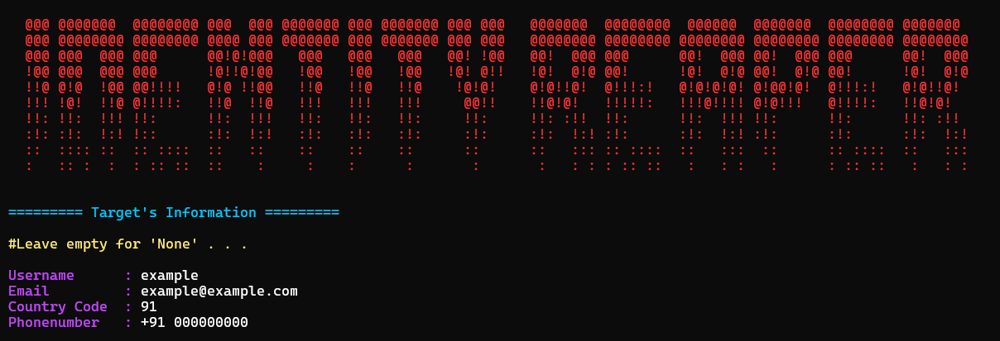

# IdentityReaper
IdentityReaper is a comprehensive OSINT reconnaissance tool designed to identify and analyze a user’s digital footprint across multiple online platforms, using the target's email, phonenumber and username.
>IdentityReaper does not alert the target



## Features

* **Comprehensive OSINT Reconnaissance**  
  Collects publicly available digital-footprint data using identifiers such as email addresses, phone numbers, and usernames.

* **Wide Platform Coverage**  
  Performs lookups across numerous online services, social platforms, and databases to compile a detailed identity profile.

* **Username Enumeration Across 300+ Sites**  
  Checks for username presence on a large network of platforms, enabling thorough footprint mapping.

* **Email and Phone Intelligence Modules**  
  Provides targeted scanning for email and phone identifiers through multiple online sources.

* **Advanced Identity Analysis**  
  Additionally, the tool analyzes email domains, retrieves available information related to phone numbers, and performs advanced username analysis capable of inferring possible real names from username patterns.

* **Modular Architecture**  
  Organized into clear modules for scanning, processing, and reporting, making the project easy to maintain and extend.

* **Lightweight and Easy to Use**
  Designed to be easy to deploy. Only requires [`requests`](https://pypi.org/project/requests/) and [`beautifulsoup4`](https://pypi.org/project/beautifulsoup4/)

* **Command-Line Interface**  
  Simple and efficient CLI workflow for quick execution, scripting, and automation.

## Installation
### Cloning the repo
```
git clone https://github.com/Bot-code-it/IdentityReaper.git
```

### Installing requirements
```bash
cd IdentityReaper/
```
```bash
pipx install -r requirements.txt
```
> [!NOTE]
> pip may be used instead of pipx.

## Usage
```bash
python3 main.py
```

> [!CAUTION]  
> Using this tool frequently in a short period of time might get you rate-limited on some sites.  
> This can lead to the tool returning false existence status.

> [!TIP]
> Use VPN or proxy to avoid getting rate limited.

## Sites:
### Phonenumber
| Name | Domain |
| - | - |
| Amazon | amazon.com |
| Instagram | instagram.com |

### Email
| Name | Domain |
| - | - |
| Amazon | amazon.com |
| Instagram | instagram.com |
| Chess | chess.com |
| Crazygames | crazygames.com |
| Spotify | open.spotify.com |
| X (Twitter) | x.com |

### Username
Username is checked on 300+ sites.

## Credits
Some parts of this project are based on ideas and code from other open-source repositories. They helped in building certain modules and features used here.
**Repositories used:**
- [Ignorant](https://github.com/megadose/ignorant)
- [Holehe](https://github.com/megadose/holehe)
- [Sherlock](https://github.com/sherlock-project/sherlock)

## Disclamer
This project is provided for educational and research purposes only. By using this repository, you agree that you are solely responsible for how you apply the code and any outcomes that result from its use. The author does not assume liability for misuse, damages, or actions taken based on this material.

## License
[GNU General Public License v3.0](https://www.gnu.org/licenses/gpl-3.0.fr.html)
